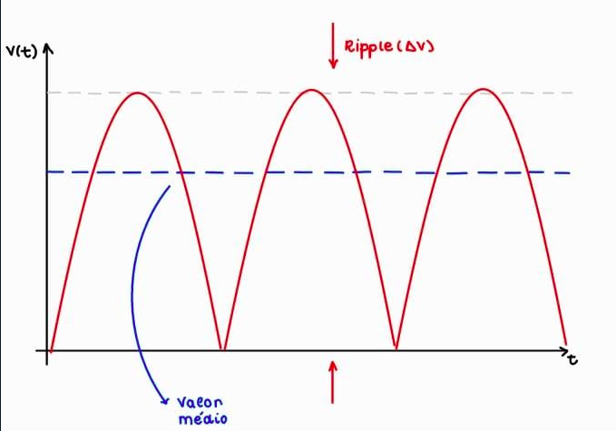
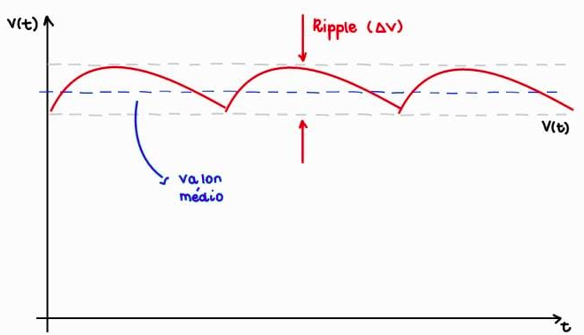
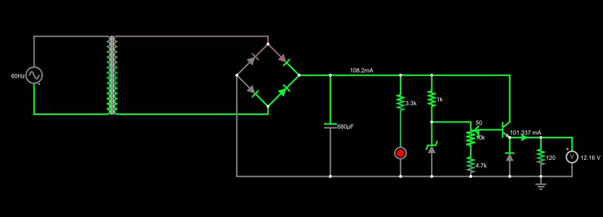

## Projeto Fonte de Tensão Regulável (3V-12V)

### Objetivo
O objetivo principal deste projeto foi construir uma fonte de tensão ajustável, que converte corrente alternada (AC) em corrente contínua (DC), operando na faixa de 3 a 12 V e 100 mA.

### Componentes 

### Teoria

#### Tensão Alternada e Transformador
Inicialmente, a tensão varia ao longo do tempo na forma de uma senoide:

Ao passar pelo transformador, a tensão é reduzida, respeitando a relação:

$\frac{V_E}{V_S} = \frac{N1}{N2}$  (i)

Onde: 
$V_{E} =$ Tensão de entrada 

$V_{S} =$ Tensão de saída

$N1 =$ Número de espiras da entrada 

$N2 =$ Número de espiras da saida

Para o projeto, utilizamos um transformador de $25V$. Por padrão, a tensão das tomadas é de %127V%, mas essa é a tensão rms ($V_{rms}$). Para calcular a tensão de pico, que será nossa tensão de entrada, temos que efetuar a seguinte operação: 
$V_{E} = V_{pico} = V_{rms} \cdot sqrt(2) \approx 179V$

Também é importante salientar que no Brasil, por padrão, a frequência da tensão das tomadas é de $60Hz$

#### Ponte Retificadora e Capacitor
A ponte retificadora é formada por quatro diodos. O principal objetivo dessa parte do circuito é converter a corrente alternada(AC) em corrente contínua(DC), ou seja, a tensão será sempre positiva.

Contudo, apesar de não ser negativa, a tensão ainda sofre uma variação significativa. Portanto, devemos estabilizar a tensão contínua.

Para isso, utilizamos um capacitor. Esse componente tem como objetivo diminuir a variação da tensão e da corrente em altas frequências.

Ao calcular a diferença entre o ponto mínimo e o ponto máximo da tensão, obtemos a chamada "tensão ripple" ($V_r$). A tensão ripple será uma medida muito relevante futuramente para a resolução dos cálculos do circuito.

#### Diodo Zener
O papel do diodo Zener é eliminar as pequenas variações remanescentes da tensão, tornando o gráfico da tensão uma reta constante.

#### Potenciômetro
O potenciômetro é um resistor de resistência ajustável. No circuito, sua função é regular o valor da tensão. No nosso caso, o intervalo de variação será de 3 a 12 V.

### Cálculos

#### Tensão de Saída
Inicialmente, medimos com o auxílio de um multímetro o valor de saída $V_S \approx 18V$.

Após passar pela ponte de diodos, há uma queda de tensão. Por serem compostos majoritariamente de silício, cada diodo consome aproximadamente 0,7V. Em cada ciclo, dois diodos são usados, resultando em uma queda total de 1,4V. Dessa forma, a nova tensão nos capacitores é de $V'_{S} = 23,6V$.

#### Cálculo da Capacitância
A capacitância pode ser obtida através da seguinte equação:

$C = \frac{I}{f \cdot V_{r}}$  (ii)

Onde $I$ corresponde à corrente total do circuito. 

Sabemos que $f = 120Hz$, pois durante o processo de retificação de onda, o período $T$ da onda é reduzido pela metade e, como $f = \frac{1}{T}$, a frequência após a retificação é $f = \frac{2}{T}$.

##### Calculo do Ripple
Ainda para o cálculo da capacitância, devemos calcular a tensão ripple da função de onda. O ripple é, basicamente, a diferença entre a tensão máxima $V_{max}$ e tensão mínima $V_{min}$, contudo, uma maneira mais fácil de calcular a porcentagem relativa a tensão $V_{S'}$ que desejamos para o ripple. Para melhores resultados, queremos que o ripple não seja superior à 10% de $V_{S'}$. Logo: 

$V_{r} = 0,1 \cdot V'_{S} = 2,36V$  (iii)

##### Tensões Máxima e Mínima do Circuito 
De posse da porcentagem que desejamos para o Ripple, podemos calcular também a tensão máxima e mínima do circuito, tal que: 

$V_{max} = V'_{S}(1-\frac{ripple}{2})$  (iv)

Substituindo os valores, temos: 

$V_{max} = 23,6\cdot(1-\frac{10}{100\cdot2}) = 22,42V$ 

Para a tensão mínima, obtemos: 

$V_{min} = V_{max} - V{r} = 20,06V$

##### Cálculo da corrente 
O cálculo da corrente total do circuito seria extremamente trabalhoso, portanto, utilizamos o valor fornecido pela simulação do FALSTAD, tal que $I \approx 112,3mA$. 

Com os dados obtidos, é possível substituir as informações na equação (ii), obtemos: 

$C = \frac{112,3}{120\cdot2,36} \approx 365,53\mu F$ 

Desta forma, o menor capacitor necessário é de 365,53 \mu F. 

É importante salientar que o capacitor que adquirimos possui uma capacidade muito superior à recomendada. Isso ocorreu porque, inicialmente, projetamos o circuito para operar com uma tensão $V_{S} = 18V$. No entanto, não conseguimos encontrar um transformador com essa especificação. Apesar de não ser a solução mais econômica devido a esse contratempo com o capacitor, o projeto funciona adequadamente.

### FALSTAD 

[Link do circuito](https://tinyurl.com/2fdwl3qa)

### Membros do Grupo 
|Nomes|Nº USP|
|-----|------|
|Caio Capocasali | 12541733|
|Driely Fernanda Oliveira de Abreu | 11879575|
|Gustavo Alvares Andó | 15457345|
|Maria Clara de Souza Capato | 15475294|

### Vídeo do projeto 

